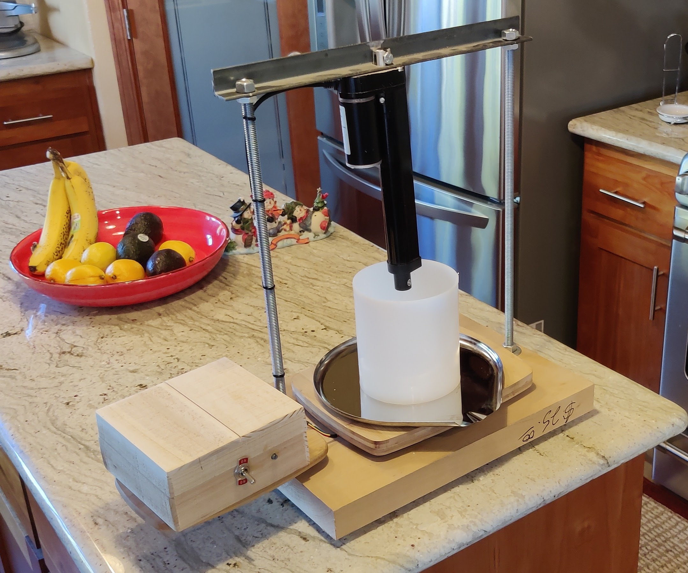
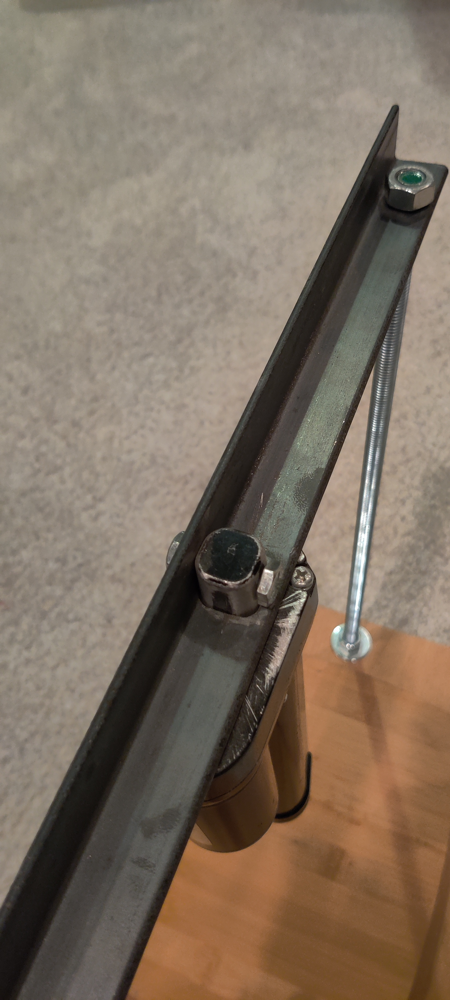
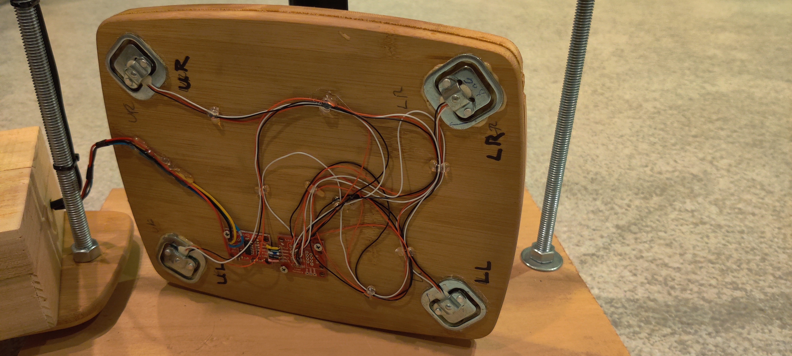
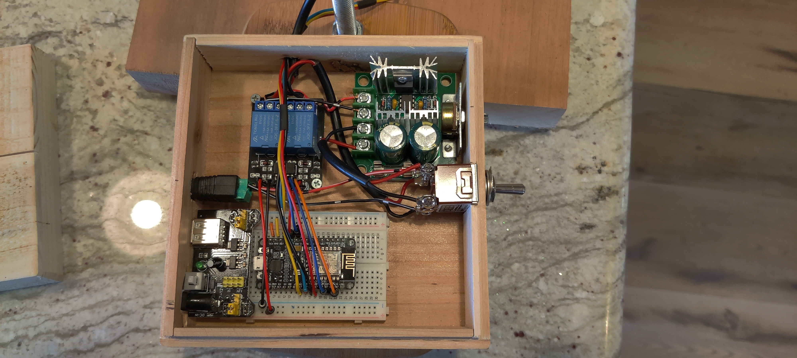
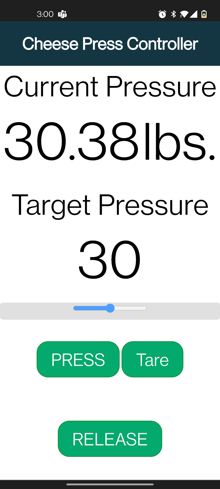
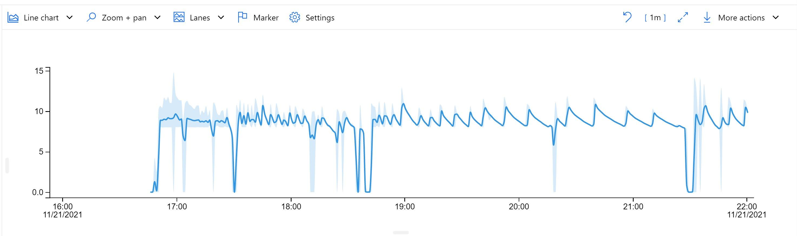

# IoT Cheese Press

My wife started making cheese as a COVID pandemic hobby to pass time. She started with a basic cheese making kit and needed more reliable tools to improve her product. After several cheese making classes and pounds of cheese filling her cheese cave(repurposed wine fridge), more reliable pressure and temperature control was required to produce repeatable recipes. At 5 ft., lugging weights in the kitchen was not an option. Spring and screw press are not accurate and need constant adjustment. After a little internet research I found Arduino projects using load cells that gave me an idea. 

The wife is meticulous in tracking recipes and cheese making activity. She records everything from humidity to curd cutting and time/temp durations of every step.  However, recipe repeatability stops when pressing starts.

I watched her during many sessions and observed two problems; **pressure** and **temperature**. She was spending too much time stressing over meter readings to enjoy her hobby. Practice did not reduce the effort. Eventually we would go to bed and  abandon the press, knowing pressure and temperature would rapidly drop. 

### Pressure Problems
Accurate constant weight is necessary, increasing in increments of hours up to an 18 hour period. Her cheese press applies pressure to curds in a mold that sit on a bathroom scale. The curd extrude whey under pressure reducing pressure applied from the press. She(we) must frequently adjust the press to restore the pressure. Asleep at night, no one is awake to maintain pressure. This prevents repeatable batches of cheese.
### Temperature Problems
Seasonal temperature changes effect pressing temperature. She wraps the press with bath towels and uses a heating pad to keep the curd temp between 70-90 degrees. This also requires constant monitoring and tweaking.

## Mission
Build a cheese press that does not require manual adjustments or monitoring during the press period. It must be user friendly, compact, safe, and preserve historical timelines of each batch.

## Approach
Removing any two requirements would make this project much simpler. Productizing this has been discussed so all requirements must be met.

I found an IoT lab packet from an old JavaOne convection in SF. Did some Googling and found the main component was an ESP8266/NodeMCU. An Arduino platform with built-in WIFI and many support libraries such as a webserver, support HX711(the scale loadcells), IoT, and OTA. A little more googling and this impressive component will do the job. Next was an exhaustive search for something that can apply pressure at a reasonable price. Pneumatics, hydraulics, and compressed gas were eliminated immediately. The solenoid screws on my CNC seemed like good candidates but could not provide the desired power for what I was willing to spend. Through solenoid searches on Amazon, Amazon show what similar client searchers searched. Others searched linear actuators. Linear actuators are powerful, use low power, and move slowly. Two of them adjust the hospital beds of some large patients with no effort. I ordered one to test and it proved adequate.

In the middle of this project I got certified in an Azure IoT Developer class. I decided to put my new found knowledge to use and IoT enable the press. The press publishes metered readings to an IoTHub for display in TimeSeries Insights. The code is included but disabled. In a future release influxDB or mysqlite will be added for historical graphing.

**Note of caution:** The linear actuator is rated at 100N(225lb). During the POC it pressed ~400lb breaking one of the bamboo cutting boards. My son crushed a can of soup, stopping before exploding it in the lab. I included a safety switch in the design to override the circuitry and reverse the actuator. This will crush bones beyond repair. A voltage regulator was added later to slow the actuator which offers more safety.

# Press Design
Use this for reference and modify to meet your needs. I believe reducing the base thickness to 1" and moving the circuitry below the base would get the control box out of the way. It spins on the threaded rod for easy storage, but always feels exposed when pressing cheese.

Since a picture is worth 1000 words...

The linear actuator is mounted to the angle iron with a bolt through the mounting hole. A square hole with rounded corners was cut for the base mount. The bolt holds the linear actuator in place, the angle iron supports the pressure of the actuator not the bolt.  Hacksaw marks were left on the base from cutting off a metal lip to allow the base to rest flat against the angle iron.

I glued the cracked cutting board back together and then glued it to the large cutting board, cross-grained, routing it to the same shape. In hindsight I should have CNC'ed channels for the loadcell wires to hide the wiring. Load cells are wired to an combinator before the HX711. Pockets were CNC'ed for each load cell to allow the pressure plate to recede while under pressure.

## Press Parts List
2 16" x 5/16" threaded rods + nuts and washers
1/2" angle iron
12"x18" 1.5" thick wood base
[Linear Actuator 100N 4" 12V DC](https://www.amazon.com/dp/B07H4KLFM7/?coliid=I138LPJMLOMS24&colid=IOLMGL6Q9GYB&psc=1&ref_=lv_ov_lig_dp_it)
[Farberware 3 piece bamboo cutting boards](https://www.amazon.com/Farberware-5070344-Bamboo-Cutting-Board/dp/B004GJXE0E/ref=sr_1_4?keywords=farberware%2bbamboo%2bcutting%2bboards&qid=1638247838&s=industrial&sr=1-4&th=1)
Hobby Lobby wood box with lid

# Circuit Design
I consulted several EE co-workers on PCB design and they said it was overkill. They use breadboards and solderless connections on hobby projects that last years. Taking their advice I used screws and hot glue to assemble the circuit components in the case. </shame_off> I will master AutoCAD before creating a Kickstarter project. The DPDT switch is in not included in the circuit diagram

## Mobile Web App
The press can only be controlled by a simple HTML5 web page hosted on the ESP8266. It uses WebHooks to continually display the current pressure and log output. User controls include a **slider bar** to adjust the target pressure between 10lbs and 70lbs, and **buttons** to engage the press to the target pressure, release the press and tare the scale. 

A second web page(not pictured) streams raw logging data for diagnostics since Arduino Sketch cannot be connected to the USB for serial I/0.

## Time Series Insights
Below is pressure data graphed using Azure's IoT Time Series tool. The target pressure is 10lbs for the Monterey Jack  being made, as the whey is squeezed out the pressure drops. When the current pressure is 2lbs below the target pressure the linear actuator is engaged until the current pressure equals the target pressure. 

The IoT client code remains in github, but disabled. Use this lab to create an IoT Hub and Time Series Insights. It will provide useful formation.  https://github.com/MicrosoftLearning/AZ-220-Microsoft-Azure-IoT-Developer/tree/master/Allfiles/Labs/10-Explore%20and%20analyze%20time%20stamped%20data%20with%20Time%20Series%20Insights

 ##  InfluxDB/Grafana 
 Coming soon.

## Parts list

Amazon gets all my business. I do not get pass-thru kickbacks and am not advertising for them. Feel free to use my list or search for better prices. 

Amazon List: https://www.amazon.com/hz/wishlist/ls/IOLMGL6Q9GYB?ref_=wl_share

ALITOVE DC 12V 5A Power Supply Adapter Converter Transformer AC 100-240V input with 5.5x2.1mm DC Output Jack for 5050 3528 LED Strip Module Light  
Offered by ALITOVE.
$11.99

eBoot 3 Pieces 400-Point Solderless Circuit Breadboard with 65 Pieces M/M Flexible Breadboard Jumper Wires  
Offered by Shappy Online.
$10.59

FTCBlock MB102 Breadboard Power Supply Module DC3.3V/5V for Arduino Board Solderless Breadboard  
Offered by Southern Tech.
$6.29

MCIGICM 2 Channel DC 5V Relay Module for Arduino UNO R3 DSP ARM PIC AVR STM32 Raspberry Pi with Optocoupler Low Level Trigger Expansion Board  
Offered by MCIGICM.
$6.99

ECO LLC 1000N High Speed 14mm/s Black Actuator Motor 4 Inch 4" Stroke Linear Actuator DC12V with Mounting Brackets (Not Include Wiress Remote Controller)  
Offered by ECO LLC.
$39.99

Baomain Toggle Switch DPDT ON/ON 2 Position 250VAC 15A 125VAC 20A 1/2" mounting Hole Screw Terminal  
Offered by Baomain.
$6.49

UL Listed 9V AC/DC Power Adapter for Arduino/Schwinn Bike A10 A20 A40 220 430 Elliptical Trainer/Crosley Cruiser CR8005A - Center Positive 5.5x2.1mm Power Supply for UNO R3 - Only for Listed Model  
Offered by Tbuymax.
$9.50

HiLetgo 12V~40V 10A PWM DC Motor Speed Control Switch Controller Voltage Regulator Dimmer for Arduino  
Offered by HiLetgo.
$7.49

HiLetgo 3pcs ESP8266 NodeMCU CP2102 ESP-12E Development Board Open Source Serial Module Works Great for Arduino IDE/Micropython (Large)  
Offered by HiLetgo.
$16.39

4pcs 50kg Load Cell Half Bridge Strain Gauge Human Body Scale Weight Sensor + 1pc HX711 Amplifier AD Module for Arduino  
Offered by DIYmalls.
$7.99

